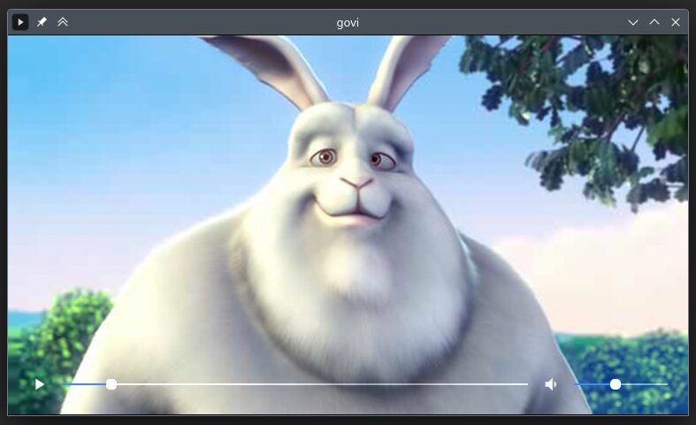
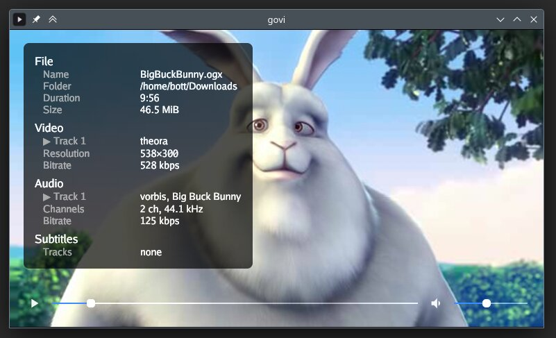

# govi

A minimalistic video player based on mpv (libmpv via go-mpv): it plays a file,
gets out of the way, and leaves the keyboard in charge.

> **Status:** under development. Things work, but interfaces, config and
> shortcuts may still change between versions.

## Screenshots





## Install

### macOS (Homebrew)

A macOS cask is published into this repository on every tagged release. Because the repo
isn't named `homebrew-*`, tap it with an explicit URL, then install:

```bash
brew tap andresbott/govi https://github.com/andresbott/govi
brew install --cask andresbott/govi/govi
```

`mpv` is pulled in as a dependency (it provides libmpv), and `brew upgrade` will track
future releases. Apple Silicon only.

This installs `govi.app` into `/Applications` — a Dock icon, a Launchpad entry, and
"Open with → govi" in Finder — and symlinks the `govi` command onto your `PATH`, so
both of these work:

```bash
govi ~/Movies/clip.mkv    # from a terminal
open -a govi              # or launch it from Launchpad / Spotlight
```

Prefer not to use Homebrew? Download `govi_<version>_macos_arm64.dmg` from the
[releases page](https://github.com/andresbott/govi/releases), open it and drag
`govi.app` into Applications. Install `mpv` yourself in that case (`brew install mpv`) —
govi needs libmpv at runtime.

### Debian / Ubuntu

Download the `.deb` for your architecture from the
[releases page](https://github.com/andresbott/govi/releases) and install it
(this also pulls in libmpv):

```bash
sudo apt install ./govi_*_amd64.deb
```

### Other

Grab a prebuilt `tar.gz` archive from the
[releases page](https://github.com/andresbott/govi/releases).

## Usage

```sh
govi <file>    # play a file
govi <dir>     # play all videos in a folder
govi .         # play all videos in the current folder
govi           # same as `govi .`
govi version
```

An empty folder (no videos) opens the idle screen — drop a file on it to play.

## Distinctive features

- **Automatic playlist** — opening a file makes its folder the playlist, so
  next/previous walks the sibling videos without any setup.
- **File deletion from the player** — move to trash or delete permanently,
  with a confirmation step and auto-advance to the next video.
- **Fully controllable with shortcuts** — every action is keyboard-driven and
  rebindable, either from the preferences overlay or the config file.

## Development

Common tasks are driven by make:

```sh
make help     # list all targets
make test     # run the go tests
make lint     # run golangci-lint
make verify   # full verification suite (test, lint, license-check, benchmark, coverage)
make build    # build a snapshot binary with goreleaser
```

### Release

Releases are published by GitHub Actions when a version tag is pushed:

```sh
make tag version="v0.1.0"
```
